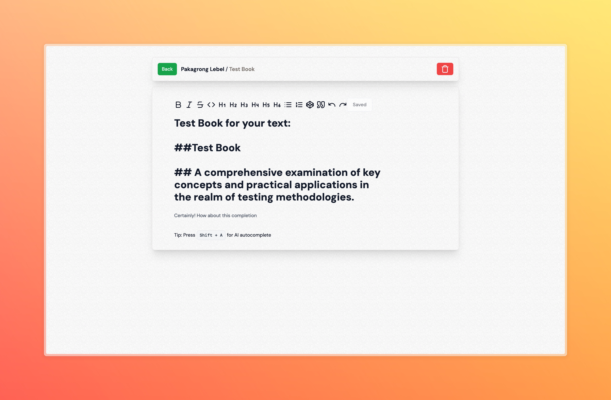
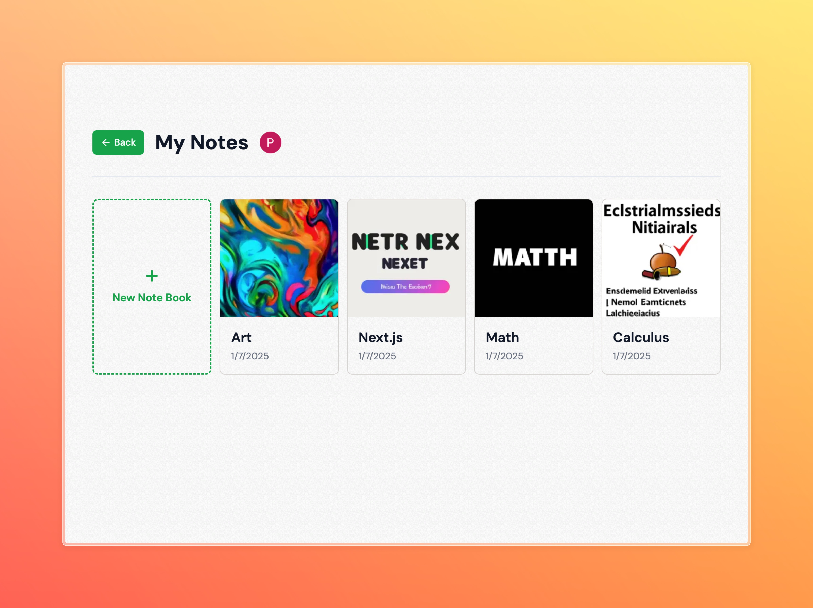

# 📝 AIdeation AI Notes App



This project combines Next.js with Drizzle ORM for PostgreSQL database management, inspired by [Elliott Chong
's x FreeCodeCamp tutorial](https://www.youtube.com/watch?v=qDunJ0wVIec).



## Tech Stack


## Prerequisites

- Node.js 18+ 
- PostgreSQL database
- npm or yarn or pnpm

## Getting Started

1. Clone the repository:
```bash
git clone https://github.com/pakagronglb/aideation-ai-notes-app.git
cd aideation-ai-notes-app
```

2. Install dependencies:
```bash
npm install
# or
yarn install
# or
pnpm install
```

3. Create a `.env` file with your database credentials:
```env
# Database Configuration
DB_HOST=your_host
DB_PORT=5432
DB_NAME=your_database_name
DB_USER=your_username
DB_PASSWORD=your_password

# Add any other environment variables here
NEXT_PUBLIC_API_URL=http://localhost:3000
```

4. Run the development server:
```bash
npm run dev
# or
yarn dev
# or
pnpm dev
```

Visit [http://localhost:3000](http://localhost:3000) to see your application.

## Database Setup

1. Install database dependencies:
```bash
npm install drizzle-orm drizzle-kit pg @types/pg tsx
```

2. Create Drizzle configuration file:
```typescript
// drizzle.config.ts
import type { Config } from "drizzle-kit";
import * as dotenv from "dotenv";

dotenv.config();

export default {
  schema: "./src/lib/db/schema.ts",
  out: "./drizzle",
  driver: "pg",
  dbCredentials: {
    host: process.env.DB_HOST || "localhost",
    port: parseInt(process.env.DB_PORT || "5432"),
    database: process.env.DB_NAME!,
    user: process.env.DB_USER!,
    password: process.env.DB_PASSWORD!,
  },
} satisfies Config;
```

3. Generate database migrations:
```bash
npx drizzle-kit generate
```

4. Run migrations:
```bash
npx tsx src/lib/db/migrate.ts
```

### Database Schema

The schema is defined in `src/lib/db/schema.ts`. Example schema structure:
```typescript
import { pgTable, serial, text, timestamp } from 'drizzle-orm/pg-core';

export const users = pgTable('users', {
  id: serial('id').primaryKey(),
  name: text('name').notNull(),
  email: text('email').notNull().unique(),
  createdAt: timestamp('created_at').defaultNow(),
});
```

### Database Client Setup

Create a database client in `src/lib/db/index.ts`:
```typescript
import { drizzle } from 'drizzle-orm/node-postgres';
import { Pool } from 'pg';

const pool = new Pool({
  host: process.env.DB_HOST,
  port: parseInt(process.env.DB_PORT || "5432"),
  database: process.env.DB_NAME,
  user: process.env.DB_USER,
  password: process.env.DB_PASSWORD,
});

export const db = drizzle(pool);
```

## Project Structure
```
├── src/
│   ├── app/                 # Next.js app directory
│   │   ├── layout.tsx      # Root layout
│   │   └── page.tsx        # Home page
│   ├── components/         # React components
│   └── lib/
│       └── db/            # Database configuration
│           ├── schema.ts   # Database schema
│           └── migrate.ts  # Migration script
├── drizzle/               # Generated migrations
├── public/               # Static assets
├── drizzle.config.ts    # Drizzle configuration
├── next.config.js       # Next.js configuration
├── tailwind.config.js   # Tailwind CSS configuration
├── tsconfig.json        # TypeScript configuration
└── .env                 # Environment variables
```

## Features

- 🚀 Next.js 14 with App Router
- 💾 Drizzle ORM for type-safe database operations
- 🐘 PostgreSQL database
- 🔤 TypeScript for type safety
- 🎨 Tailwind CSS for styling
- 🔄 Automatic migrations
- 📱 Responsive design

## Learn More

To learn more about the technologies used:

- [Next.js Documentation](https://nextjs.org/docs)
- [Drizzle ORM Documentation](https://orm.drizzle.team)
- [Elliot Choi's Tutorial](https://www.youtube.com/watch?v=qDunJ0wVIec)
- [PostgreSQL Documentation](https://www.postgresql.org/docs/)
- [Tailwind CSS Documentation](https://tailwindcss.com/docs)

## Deployment

The easiest way to deploy is using the [Vercel Platform](https://vercel.com/new).

Check out:
- [Next.js deployment documentation](https://nextjs.org/docs/deployment)
- [Drizzle deployment best practices](https://orm.drizzle.team/docs/deployment)

## Contributing

Contributions are welcome! Please feel free to submit a Pull Request.

1. Fork the repository
2. Create your feature branch (`git checkout -b feature/AmazingFeature`)
3. Commit your changes (`git commit -m 'Add some AmazingFeature'`)
4. Push to the branch (`git push origin feature/AmazingFeature`)
5. Open a Pull Request

## Credits

This project's database setup is based on the tutorial by [Elliott Chong
 x FreeCodeCamp](https://www.youtube.com/watch?v=qDunJ0wVIec). Special thanks to Elliot for the excellent guidance!

## License

This project is licensed under the MIT License - see the [LICENSE](LICENSE) file for details.

---

⭐️ Star this repo if you found it helpful!

For issues, feature requests, or questions, please [open an issue](https://github.com/pakagronglb/aideation-ai-notes-app/issues)
